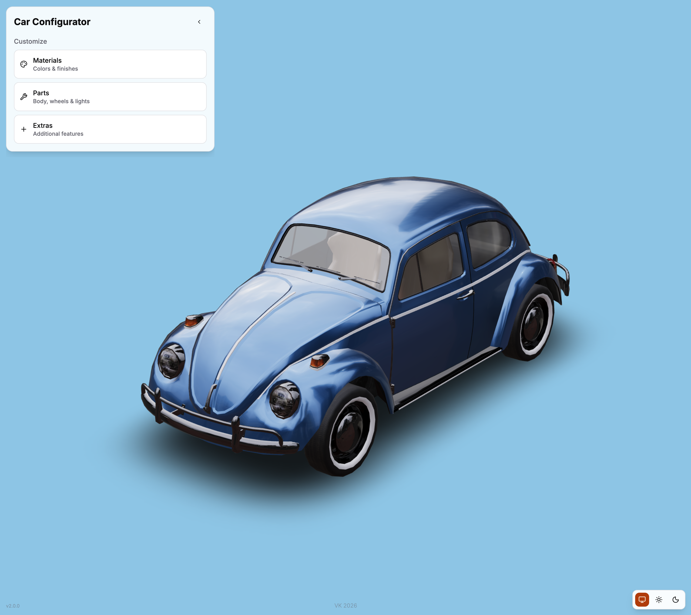

# Car Configurator
<sub>Version 2.0.0</sub>

Interactive 3D Beetle configurator built with React, Vite, Three.js, React Three Fiber, Zustand, Tailwind CSS, and shadcn/ui.



## Features

- Interactive Beetle 3D model with orbit controls and optional auto-rotation.
- Body, wheel, and headlight configuration.
- Preset materials and custom paint settings.
- Custom color picker with HEX input.
- Light, dark, and system themes with persisted theme preference.
- Responsive floating configuration menu for desktop and mobile layouts.
- Unified loading screen shown until 3D assets are ready.
- Error state with reload action when the 3D scene cannot load.
- Footer with project version and GitHub link.

## Stack

- React 19 + Vite
- Three.js, `@react-three/fiber`, and `@react-three/drei`
- Zustand
- Tailwind CSS 4
- shadcn/ui and Radix UI
- Lucide React icons
- `@uiw/react-color`

## Requirements

- Node.js 20 or newer
- npm

## Getting started

Install dependencies:

```bash
npm install
```

Start the development server:

```bash
npm run dev
```

Open `http://localhost:3000` in your browser. The port can be changed with `VITE_PORT` in `.env`.

## Scripts

| Command           | Description                                              |
| ----------------- | -------------------------------------------------------- |
| `npm run dev`     | Start the Vite development server                        |
| `npm run build`   | Create a production build                                |
| `npm run preview` | Serve the production build locally                       |
| `npm run lint`    | Run ESLint                                               |
| `npm run format`  | Format source and root configuration files with Prettier |

## Project structure

```text
src/
  App.jsx                    # Application shell and loading flow
  components/
    SceneCanvas.jsx          # Lazy-loaded 3D canvas
    scene.jsx                # Camera, lights, grid, and controls
    beetle.jsx               # Beetle model and configuration logic
    UIOverlay.jsx            # Main configurator UI
    AppLoader.jsx            # Initial loading and error states
    ui/                      # shadcn/ui components
  configs/config.js          # Parts, colors, camera, and grid settings
  hooks/                     # Theme hook
  store/                     # Zustand state
public/
  Beetle_-transformed.glb    # 3D model asset
blender/
  beetle.blend               # Blender source file
```

## Production check

Before committing changes, run:

```bash
npm run lint
npm run build
npm run preview
```

The current project version is `2.0.0` and is read from `package.json`.
